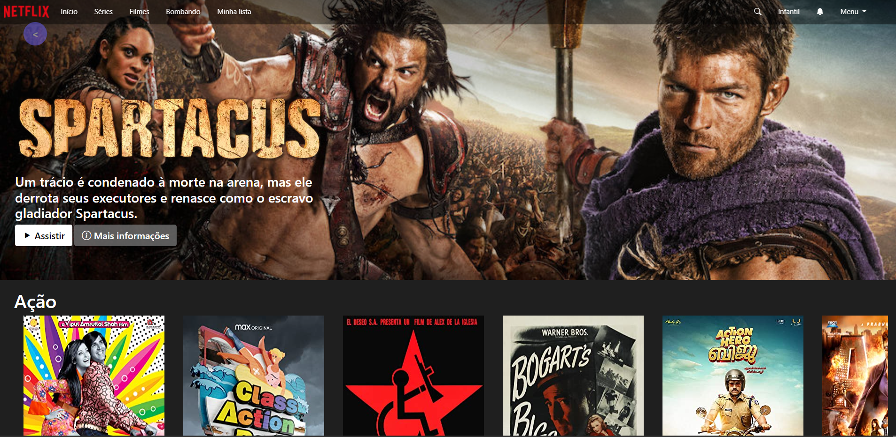

# Netflix Interface

Criação de página com aparência similar ao do Netflix, utilizando API de filmes.

## Demonstração

## Stack utilizada

**Front-end:** Html, Css, Javascript

## Aprendizados

Aprimoramento de utilização de CSS ao replicar a interface.
## Instalação

Coloque a pasta netflix-interface no local desejado.
## Rodando localmente

Abra o arquivo `index.html` em seu navegador e pronto!
## Autores
### Gabriel

|  |  |  |
| ------|-------|-----|
